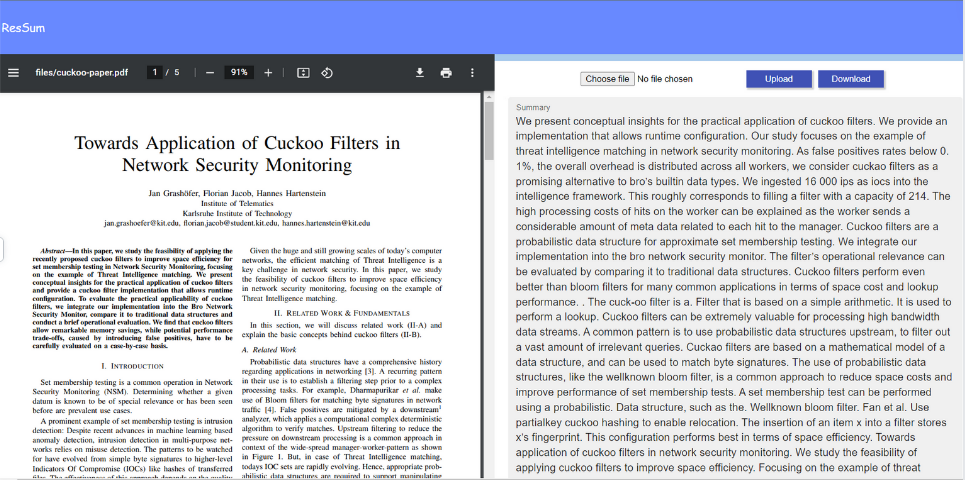

# ResSum-Backend
Research Paper Summarization

# Getting Started
1) Download the t5-large folder from https://drive.google.com/drive/folders/1ykaq5CnIVT02MPqPNth_50RhNShgeFW3?usp=sharing and place it in the root folder
2) Get API credentials from Adobe Extract API at https://developer.adobe.com/document-services/apis/pdf-extract/. Get their 'Getting Started' files and place *pdfservices-api-credentials.json* and *private.key* in the root folder
3) Setup Firebase and put *serviceAccountKey.json* in the root folder
4) Create a collection in Firestore Database by the name users and you're good to go
5) Run main.py or run **uvicorn main:app --reload** to start the backend
6) Start the frontend by running **npm start**
7) Summarize some research papers!

# Example

